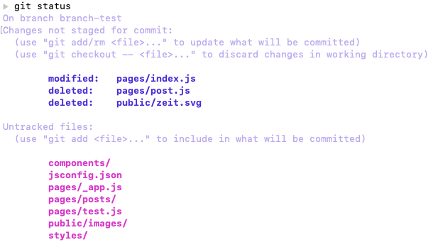

## My terminal set-up

- I am using https://ohmyz.sh/ for the shell configuration.
- You can customize it going to the file `~/.zshrc` and changing the theme, I am using is 'avit'

## Git color

Enable coloring output if it has not been enabled previously
`git config --global color.ui true`

Each `git config color.status.<something>` takes up to 3 arguments:

- Text color: normal, black, red, green, yellow, blue, magenta, cyan and white;
- Background color: normal, black, red, green, yellow, blue, magenta, cyan and white;
- Style attribute: bold, dim, ul, blink and reverse.

My git colors

```
color.ui=true
color.branch=true
color.status.meta=yellow black bold
color.diff.meta=blue black bold
color.diff.changed=magenta normal bold
color.status.changed=magenta
color.status.untracked=yellow
```

## Status color



To get this output you need the below setup

- `git config color.status.header "blue normal dim"`
- `git config color.status.untracked "magenta"`
- `git config color.status.changed "blue normal bold"`

## Diff changes

`color.diff.meta=blue black bold`

`color.diff.changed=magenta normal bold`

## Display Git config

Display all your git config: `git config --list`

[Git ref doc](https://git-scm.com/docs/git-config#Documentation/git-config.txt-colorstatusltslotgt)
