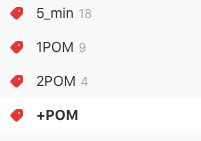

As a to do list user for multiple years, I've tried many different applications - [Remember the milk](https://www.rememberthemilk.com/), [Wunderlist](https://www.wunderlist.com/), [Habitica](https://habitica.com/static/home). It's been 4 years, I settled with one: [todoist](https://todoist.com/). They build a great product that I use on a daily basis.

I want to share my todoist organization as it might help you. I am using todoist for my personal life but also for work.

I like to keep the default inbox empty. I only use it to quickly dump ideas when I don't have time to add them to the correct project and move them across later. I tend to clean it up on a daily basis.

Todoist offers a flag system to prioritize task, I only rarely use it so won't cover it here.

## Projects

I like to keep the high level hierarchy fairly simple and always relevant - the idea behind is that these folders are areas of life that will _always_ exist.

Inside these high level areas I add sub-folders for projects. Most projects are limited in time and can be archived at some point. Some might live for a very long time, for example this blog while others will be archived within days or weeks. I typically don't have projects nested inside projects - too many steps to look inside.

## Labels

My label system changed overtime, few months ago I went back to my previous system and it's favorite.

Tasks are either labeled on the time it takes to achieve them or the action that needs to be taken. Finally I have a standalone tag 'Someday maybe', any task or idea I want to save and consider maybe doing without having a precise time frame.

### Time

I am a big fan of the [Pomodoro technique](https://francescocirillo.com/pages/pomodoro-technique) - [Pomodoro timer](http://www.tomatotimers.com/) so I tag my task in POM (short for Pomodoro cycle).

- **5 min**: any task that can be achieved under 5 min, typically checking a refund you expect or printing a return label.
- **1 POM**: a task that can be achieved within one Pomodoro (30 min - 25 min work and 5 min break)
- **2 POM**: a task that can be achieved within two Pomodoros (60 min - 25 min \* 2 + two five-minute break)
- **\+ POM**: a task that requires more than 60 min

### Action

Most of them are self-explanatory

- Email
- Phone
- Waiting: when I need to wait for someone in order to complete a task
- Write
- Research

## Filters

I like to keep filters fairly simple and separate work from personal life.

_Note that if you have emojis in your projects' names, you need to include them in your filters' queries._

### Personal

- Personal: everything excluding work and house: `##Personal 🍄 | ##Travel 🌎 | ##Health 🧘`
- No due date: `no date & !p:Work`
- Recurring: `recurring`

### Work

I have 3 filters to accommodate my workflow:

- All: `##Work 🏢`
- Next 5 days: `##Work 🏢 & 5 days`
- Work before a certain date - I work in cycles of 7 weeks so every new cycle I update the date of this query to reflect the next 7 weeks and quickly see what I need to achieve during this cycle: `##Work 🏢 & due before: July 31`
